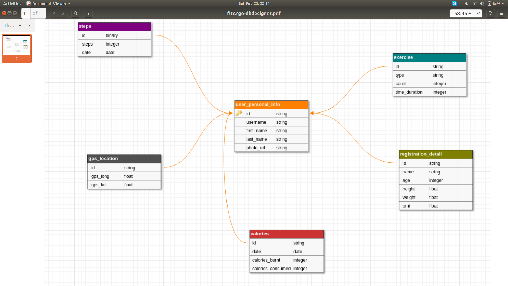

# FitArgo
FitArgo is an fitness tracking application


run the following command to install dependencies
```
pip install -r requirements.txt
```

Modify `dbconfig.json` before running `main.py` 

run the below command to run the server
```
python app.py
``` 

## database architecture 



